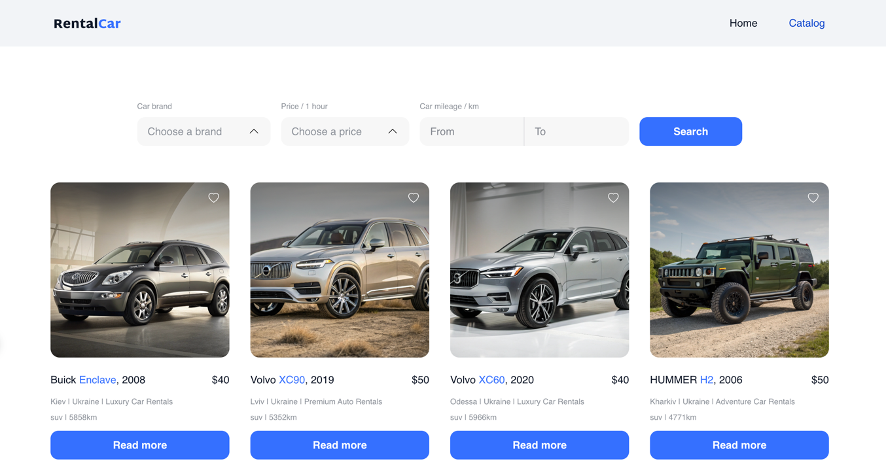

# RentalCar - Car Rental Platform 🚗💨

 <!-- Add your screenshot if available -->

A modern frontend application for a car rental service, built with React, Redux, and React Router.

## Features ✨

- **Home Page** - Attractive landing page with call-to-action
- **Catalog Page**
    - Browse available vehicles
    - Filter cars by brand, price, and mileage
    - Pagination with "Load More" button
    - Add/remove favorites
- **Car Details Page**
    - Comprehensive vehicle information
    - Booking form with validation
    - Success notifications
- **Design** - Optimized for desktop 
- **State Management** - Redux for global state (vehicles, filters, favorites)
- **Persistence** - Favorites saved in local storage

## Technologies Used 🛠️

- **Frontend**:
    - React 19.1
    - Vite (build tool)
    - TypeScript
- **State Management**: Redux Toolkit
- **Routing**: React Router v7.6
- **Styling**: Tailwind CSS
- **HTTP Client**: Axios
- **Form Handling**: Formik + Yup validation
- **Notifications**: react-hot-toast
- **Deployment**: Vercel

## Installation & Setup ⚙️

1. Clone the repository:
   ```bash
   git clone https://github.com/Duard4/RentalCar.git